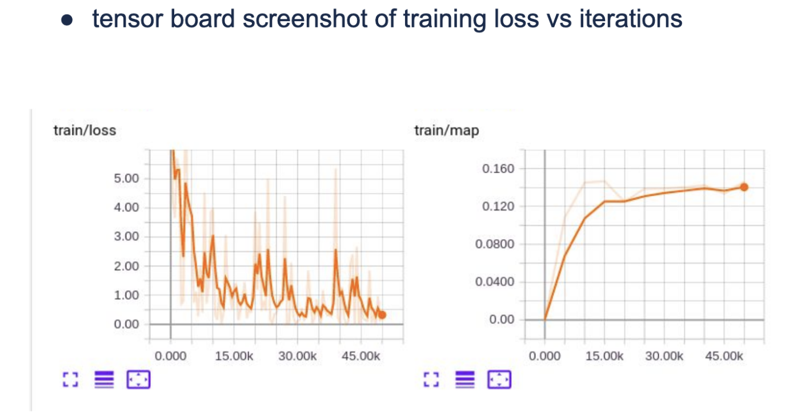

# Weakly-Supervised-Object-Localization-PyTorch
Visual Learning &amp; Recognition Assignment 2: Weakly Supervised Object Localization

This assignment is on training object detectors in the weakly supervised setting i.e. training object detectors without bounding box annotations. Implementation is based on PyTorch and Visdom and Tensorboard are used for visualizing the predictions. Sligtly simplified versions of following two approaches are implemented in this assignment:

1) Oquab, Maxime, et al. "Is object localization for free?-weakly-supervised learning with convolutional neural networks." Proceedings of the IEEE Conference on Computer Vision and Pattern Recognition. 2015.

2) Bilen, Hakan, and Andrea Vedaldi. "Weakly supervised deep detection networks." Proceedings of the IEEE Conference on Computer Vision and Pattern Recognition. 2016.

The report folder contains the assignment [report](https://github.com/BhavanJ/Weakly-Supervised-Object-Localization-PyTorch/blob/master/report/HW2_VLR_bjasani.pdf) with all the results.

More details of the assignment can be found [here](https://bitbucket.org/CMU16824Spring18/hw2-release).

### Tensorboard logs

